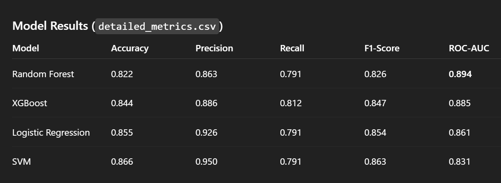
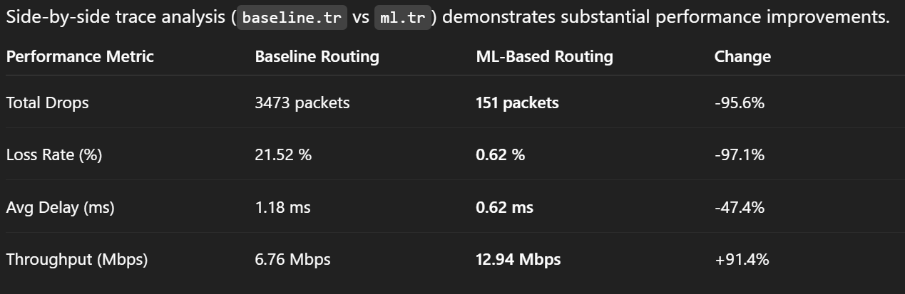

# ML-Based Predictive Congestion Control in NS2: Project Summary

## 1. Overview

This project integrates Machine Learning (ML)-based predictive intelligence into an NS2-simulated network to proactively manage congestion. Rather than relying on traditional reactive congestion control mechanisms (e.g., TCP loss-based control such as Reno/NewReno), this pipeline predicts congestion in advance using windowed temporal network metrics and applies dynamic routing (by modifying link delays) to balance network load seamlessly.

The architecture bridges discrete-event network simulation (NS2) with supervised machine learning, demonstrating cross-domain integration between networking and predictive analytics.

## 2. Dataset Collection & Feature Engineering (`feature_engineering.py`)

The dataset is generated from multiple NS2 simulations under varying traffic intensities:
- **LOW**
- **MEDIUM**
- **HIGH**

For realistic data structuring, a custom `TraceParser` processes NS2 trace logs into 1-second time windows, enabling real-time predictive modeling.

### Congestion Definition

A time window is labeled as congested if any of the following thresholds are exceeded:
- **Link utilization** > `85.0%`
- **Packet loss** > `10.0%`
- **Average delay** > `0.08 ms`

*(Ensure unit consistency — 0.08 ms corresponds to 80 microseconds.)*

This creates a binary classification target:
- `1` → Congested
- `0` → Non-Congested

### Engineered ML Features

True predictive capability is achieved using temporal lag-based modeling, where:

$$ Features(t) \rightarrow Predict \rightarrow Congestion(t+1) $$

Engineered features include:
- `throughput_lag1` — Previous window throughput
- `delay_lag1` — Previous window delay
- `loss_lag1` — Previous window loss rate
- `utilization_lag1` — Previous window utilization
- `rolling_mean_util` — 3-window moving average of utilization
- `utilization_change` — First-order difference of utilization

These lag and rolling features allow the model to anticipate congestion before it manifests, rather than detecting it post-factum.

## 3. Models and Training (`train_models.py` & `evaluate_models.py`)

Multiple supervised classification models were evaluated to predict the binary congestion label.

All input features were normalized using `StandardScaler` to ensure consistent feature scaling.

### Model Configurations

- **Logistic Regression**
  - `penalty='l2'`
  - `C=1.0`
- **Random Forest**
  - `n_estimators=100`
  - `max_depth=10`
  - `min_samples_split=5`
- **XGBoost**
  - `learning_rate=0.1`
  - `max_depth=6`
  - `n_estimators=100`
  - `eval_metric='logloss'`
- **SVM (RBF Kernel)** *(evaluated in earlier versions)*
  - `C=1.0`
  - `gamma='scale'`

### Evaluation Setup

- **80-20 Train-Test Split**
- **5-Fold Cross Validation** (`cv=5`) on training data
- Performance logged in `results/` directory

Evaluation metrics:
- Accuracy
- Precision
- Recall
- F1-Score
- ROC-AUC
- Confusion Matrix
- ROC Curve

### Model Results (`detailed_metrics.csv`)

#### Model Selection Rationale:
Random Forest was selected because ROC-AUC evaluates ranking capability across all classification thresholds, making it more suitable for probabilistic congestion prediction than accuracy alone. It demonstrated superior discrimination power and stable generalization performance.

## 4. ML Prediction and Inference (`predict.py`)

The deployed predictive module operates on continuous streaming data.

### Inference Workflow

- Maintains and updates a persistent runtime state (`runtime_state.pkl`) to preserve temporal continuity.
- Computes lag and rolling features consistently across time windows.
- Applies the same `StandardScaler.transform()` used during training.
- Generates probabilistic output using `predict_proba()`.

The output represents:

$$ P(\text{congestion} \mid \text{current features}) $$

This probabilistic formulation enables flexible threshold-based decision making.

## 5. NS2 Network Integration (`apply_ml_routing.py` & `run_demo.py`)

The predicted congestion probability is integrated directly into NS2 `.tcl` topology configurations.

### Action Threshold

If:

$$ P(\text{congestion}) > 50.0\% $$

...then dynamic routing adaptation is triggered.

#### Baseline Network Configuration
- **Link delay:** 20 ms
- **Bandwidth:** 2 Mb
- Static shortest-path routing

#### Congestion Mitigation Mechanism
When congestion probability exceeds the threshold:
1. Primary link delay is increased to **50 ms**
2. This increases routing cost
3. NS2’s shortest-path algorithm recomputes routes
4. Traffic is redistributed to alternate lower-cost paths

This simulates cost-aware adaptive routing without redesigning the routing protocol itself.

### Demonstration Process

The `run_demo.py` script:
1. Clears previous runtime state
2. Executes baseline simulation
3. Executes ML-enhanced simulation
4. Generates performance comparison
5. Opens parallel NAM (Network Animator) visualizations

This allows direct visual comparison of routing behavior.

## 6. Final Performance Impact vs Baseline (`ns2/results/comparison_metrics.csv`)

Side-by-side trace analysis (`baseline.tr` vs `ml.tr`) demonstrates substantial performance improvements.

### Conclusion

By integrating Random Forest-based predictive modeling with lag-driven temporal features, the system anticipates congestion before packet drops occur. The resulting proactive routing adaptation:
- Virtually eliminates packet drops
- Reduces loss rate by over 97%
- Nearly doubles throughput
- Improves overall network stability

This demonstrates that machine learning-driven predictive congestion control significantly outperforms static routing approaches within the NS2 simulation environment.